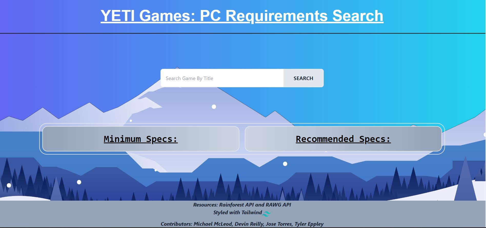
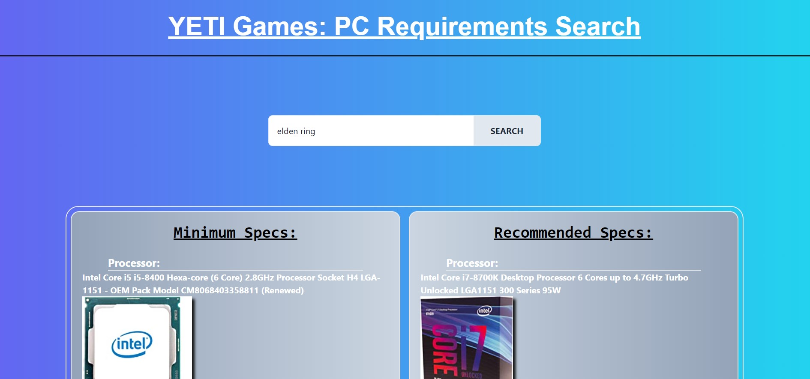

<a name="logo" href="https://chemicalmodel.github.io/Yeti-Games/">

</a>
<br />
<h1 style="font-size: 70px; text-align: center; background: linear-gradient(to right, #6268f2, #23d0ee); -webkit-background-clip: text; -webkit-text-fill-color: transparent;"><strong>YETI GAMES</strong></h1>


# [Introduction](#introduction)

YETI GAMES is a web application that offers the best way to check if your gaming PC system will meet the requirements to play the game of your choice. 
- It offers a search option to enter your desired game.
- It will pull that games minimum and recommended system hardware requirements. 
- If your current system does not have that hardware installed, then you are presented with an option to puchase that hardware from Amazon. 

Note: This application is perfect for those who are newer to the gaming life, and want to check their current PC system setup.

<br />

---

<br />

## Table of Contents
- [Introduction](#introduction)
- [Project Status](#project-status)
- [User Story](#user-story)
- [Getting Started](#getting-started)
  - [Installation](#installation)
  - [Useage](#useage)
  - [Features](#features)
  - [Examples](#examples)
- [Credits](#credits)
  - [Contributors](#contributors)
  - [Acknowledgements](#acknowledgements)
- [License](#license)


<br />

---

<br />


## [Project Status](#project-status)
Minimal Viable Product(MVP) - Deployed<br />
Please visit our <a href="https://chemicalmodel.github.io/Yeti-Games/">YETI GAMES Deployed Site.</a>


<br />

---

<br />


## [User Story](#user-story)
```
GIVEN a web app with a search bar
WHEN I search a game title in the search bar
THEN I am presented with the minimum and recommended hardware requirements
WHEN I click the image below the minimum or recommended hardware requirements
THEN I am brought to a new tab with the product page on Amazon.com
WHEN I revisit the web app
THEN I see a drop-down list with previous game title searches
```


<br />

---

<br />


# [Getting Started](#getting-started)
<br />

### [Installation](#installation)
This web application is avaliable for anyone to use on the web. There is no installation required.

### [Useage](#useage)
The usage of this site was designed for ease of movement and accessibility.
<br />
1. Once the page loads and you have read the prompt instructions, please enter your desired game title into the center search bar. 
2. Once the page finishes loading and displaying all the content, you will see you are presented with the name of the minimum and recommended hardware fro your desired game. 
3. If you desire to purchase the needed hardware, then any of the images should bring you to the Amazon product page where you are able to make your purchase. 

### [Features](#features)
There are a few special features that we have included on this page:
- The header title is a link to the GitHub Repo Page
- The Tailwind logo in the footer of the page links to the Tailwind homepage
- More to Come!!

### [Examples](#examples)
<br />
Here is an example our YETI Games landing page.



<br />

Here is an example of a search for the minimum and recommended hardware for the game Elden Ring.


<br />

---

<br />


# [Credits](#credits)
<br />

### [Contributors](#contributors)
* Michael McLeod
* Devin Reilly
* Jose Torres
* Tyler Eppley

### [Acknowledgements](#acknowledgements)
* Special thanks to all the teachers and TA's at UCF Full-Stack Bootcamp. Without their generious time and efforts in teaching and guiding, this project would never have met MVP.
  * **John Dinsmore** 
  * **Kristofer Marshall**
  * **Rider Cogswell**
* Thanks to all the students in the UCF Bootcamp for their constant encouragement and help
* Images by <a href="https://www.freepik.com/free-vector/winter-landscape-background_3376779.htm#query=mountian&position=10&from_view=search&track=sph">Freepik</a>

<br />

---

<br />


# [License](#license)
No current Licenses

